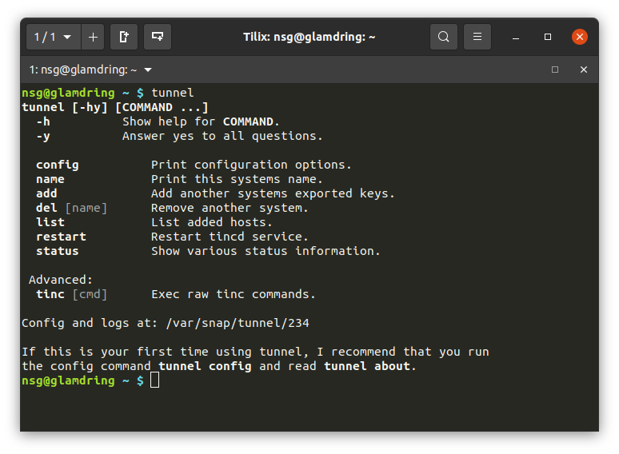

# Tunnel

This project contains the sources of the snap `tunnel`, it's used to bridge
network segments together over the Internet.

This snap relies on the software project [tinc](http://tinc-vpn.org) that
does the actual work to mesh network segments together. Tinc has several
advanced features that is out of scope for this snap. If you disagree or
like to have something added, please open an issue.

## A little warning

This snap is based on a pre-release of Tinc 1.1. I'm using 1.1 because it
contains several improvements, like for example the invite future.
**Do not** use this in production. I'm using this my self successfully to
bridge both servers and workstations together.

The tunnel may also be restarted when snapd updates this snap, or when you
change any settings. This is expected behavior, if you can't handle rare
short disconnects please do not use this snap.

## Install

The get the latest stable version, type `snap install tunnel`.
Master of this repository is published to the edge channel. Try it with `snap install --edge tunnel`.

## Why tunnel and not just tinc?

There is a little setup you need to do like create a tinc.conf, tinc-up
and down scripts and the exchange the host keys. Configure bridges and
possible setup routing to get started.

Tinc 1.1 solves a lot of that for some use cases with the "tinc join"
feature but I feel that there still is a few pieces missing so I made
this snap.

If you need to customize the setup outside what this snap provides, I
recommend that you take your time to install tinc yourself.
